# putty基础

- [返回](putty.md)
  ***
- **连接服务器**  
  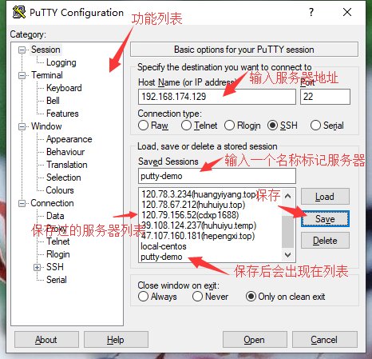  
  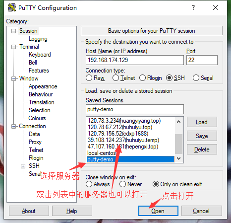  
  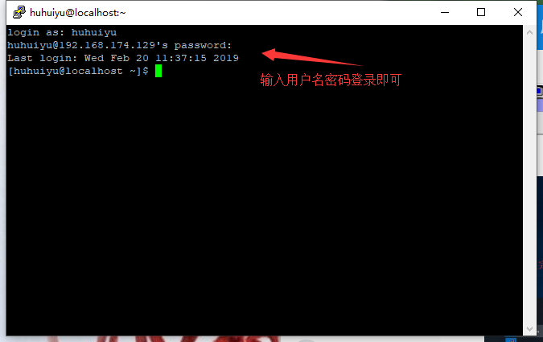  

- **ssh连接服务器**  
  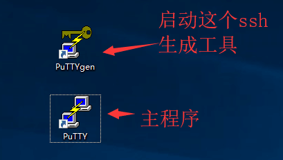  
  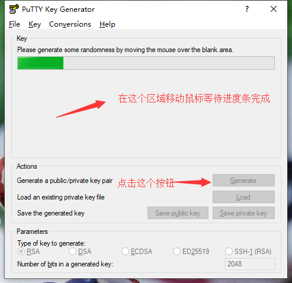  
  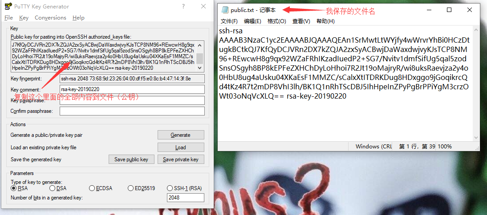  
  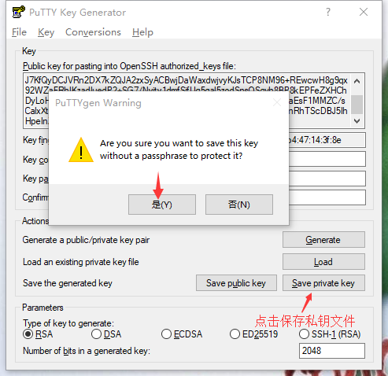  
  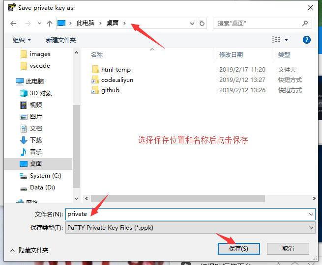  
  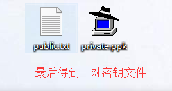  
    
    
    
    
  上面的四个指令  

  ```linux
    mkdir ~/.ssh
    chmod 700 ~/.ssh
    vi ~/.ssh/authorized_keys
    chmod 600 ~/.ssh/authorized_keys
  ```

  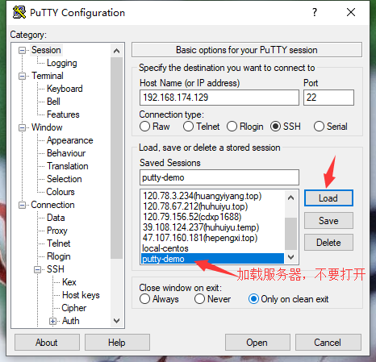  
  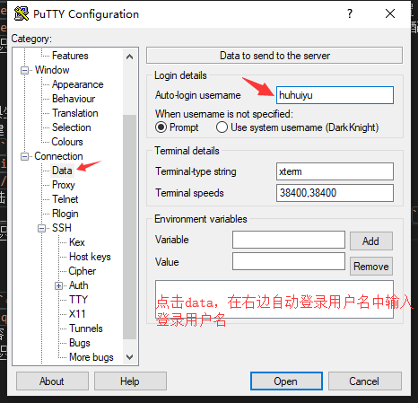  
  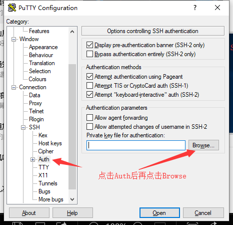  
  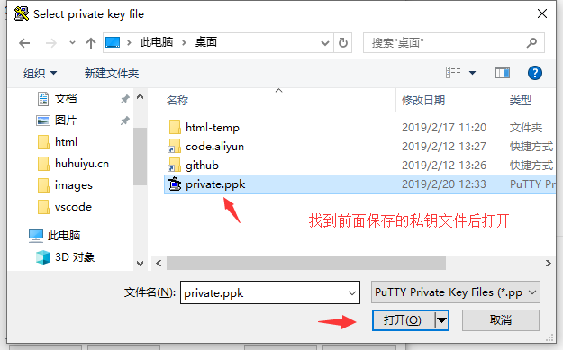  
  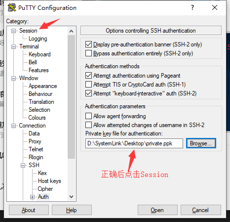  
  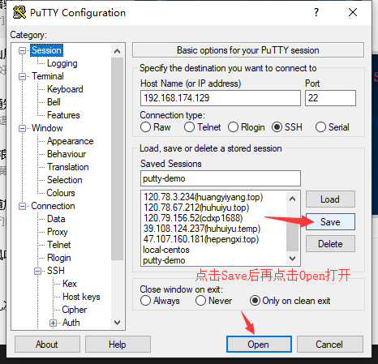  
  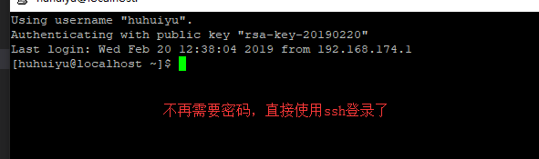  

  **拒绝使用密码登录-一旦开启，丢失ssh密钥将无法登录！！！**  
  执行`vi /etc/ssh/sshd_config`配置ssh  
  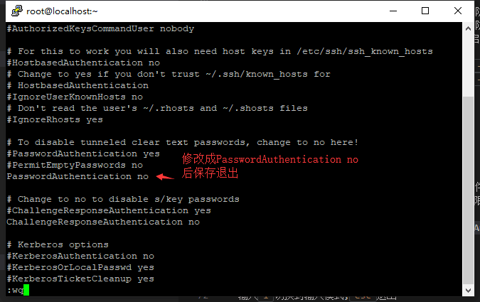  
  执行`systemctl restart sshd.service`重启ssh服务生效  
  ***
- [返回](putty.md)