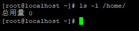
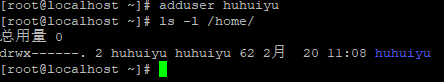
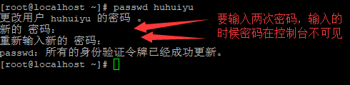
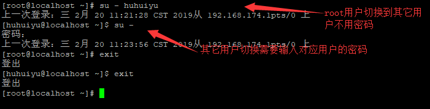
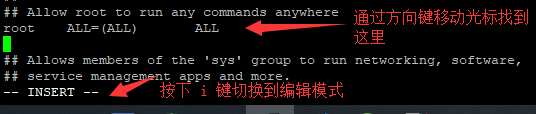
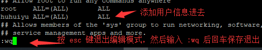

# 用户管理

- [返回](README.md)
  ***
- 执行`ls -l /home/`查看用户列表  
  
- 执行`adduser username`创建参数username指定的用户  
  
- 执行`passwd username`修改参数username指定用户的密码  
  
- 执行`su - username`可以切换到参数username指定用户,执行`su -`切换到root账号,执行`exit`退出当前用户登录，root切换其它账号不需要密码，其它情况都需要输入用户密码  
  
- 执行`visudo`编辑sudo权限  
    
  
- 执行`userdel -rf username`删除参数username指定的用户
  ***
- [返回](README.md)