# git安装

- [返回](README.md)
  ***
- [centos版本安装](../centos/git.md)  
- windows版本安装  
  [官方网站](https://git-scm.com/)  
    
    
  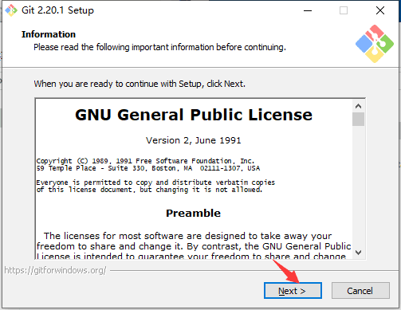  
  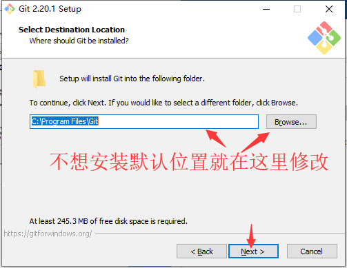  
  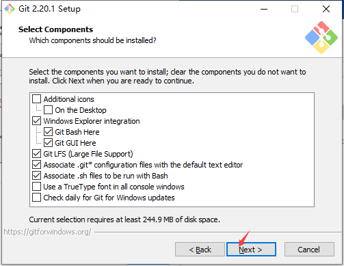  
  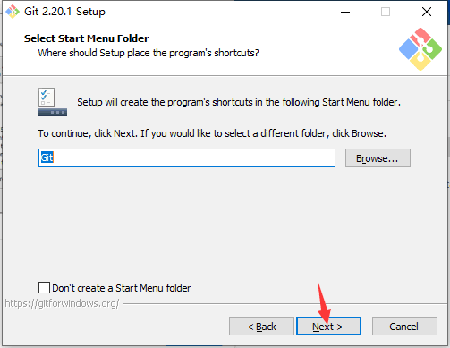  
    
  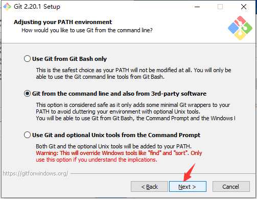  
  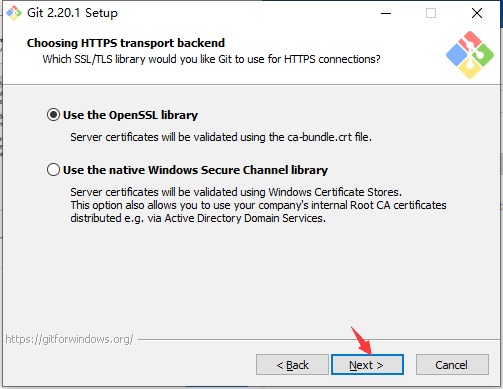  
  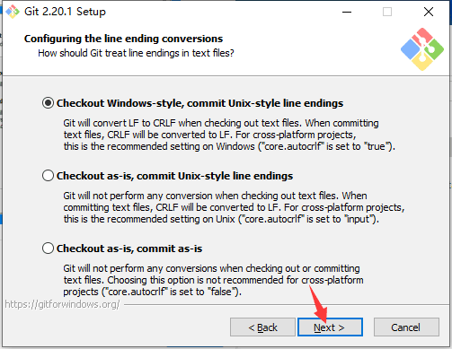  
  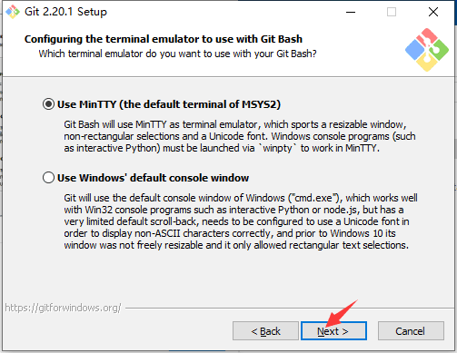  
  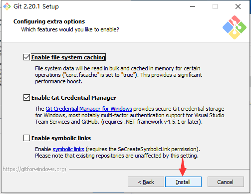  
  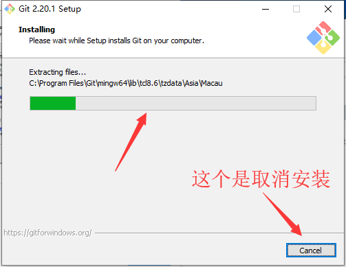  
  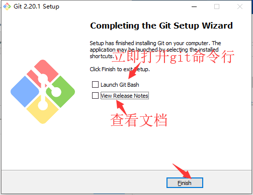  
  ***
- [返回](README.md)