# ssh

- [返回](README.md)
  ***
- ssh配置  
    
  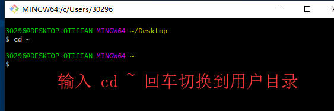  
  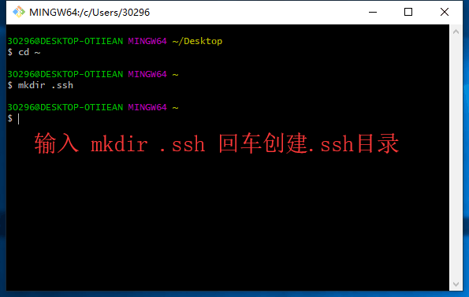  
  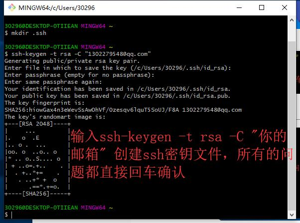  
  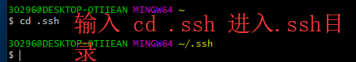  
  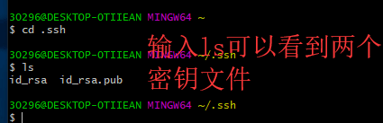  
  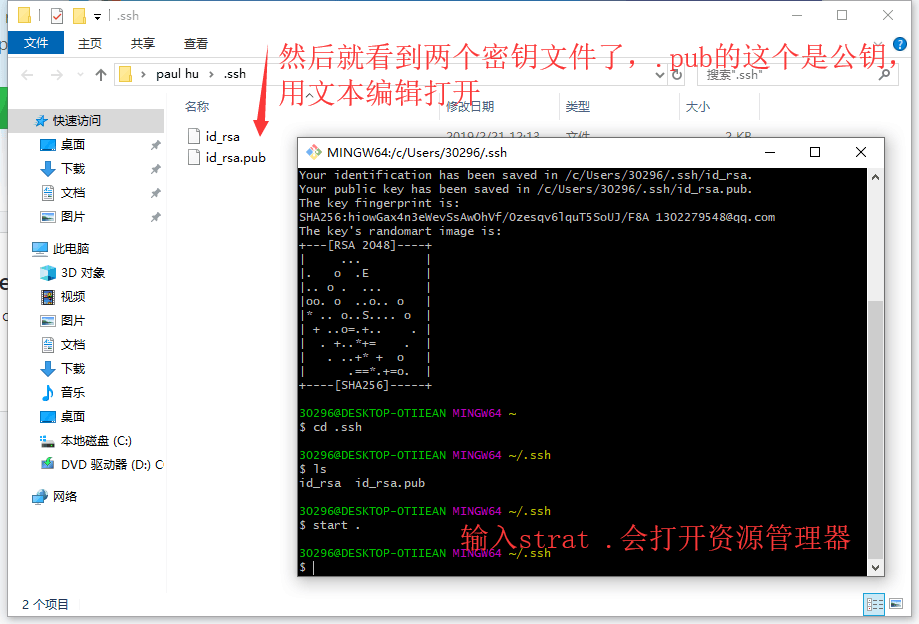  
  上面的指令  

  ```powershell
    cd ~
    mkdir .ssh
    ssh-keygen -t rsa -C "你的邮箱"
    cd .ssh
    ls
    start .
  ```

  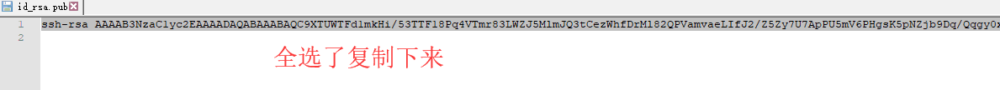  
  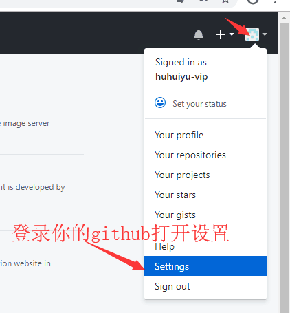  
  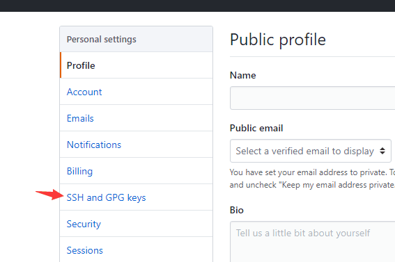  
  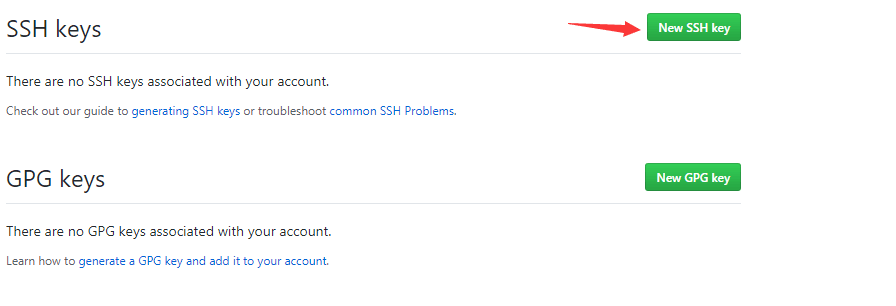  
  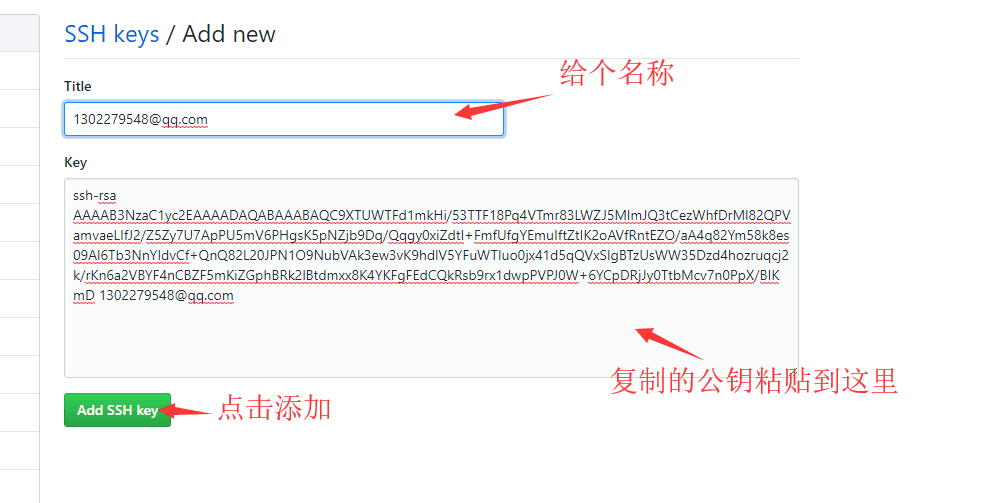  
  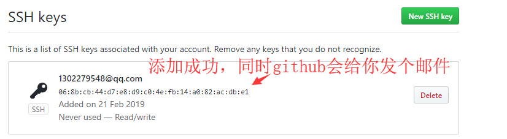  
  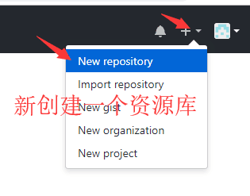  
  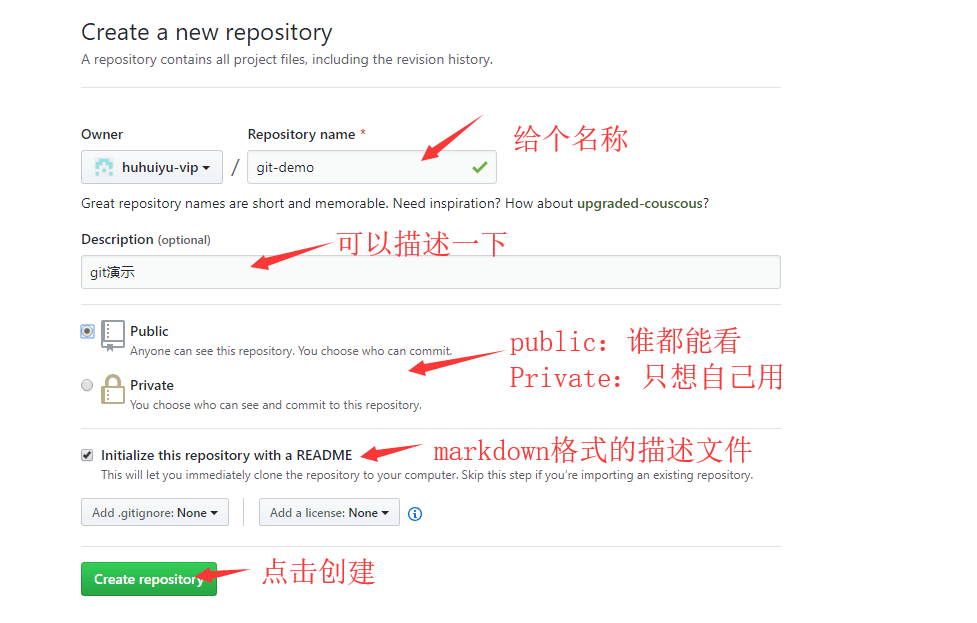  
  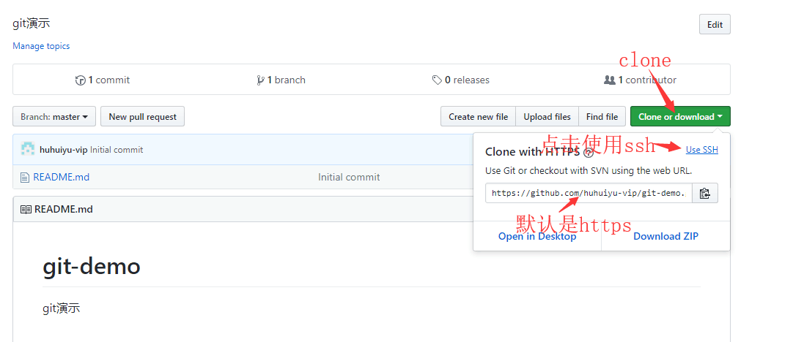  
  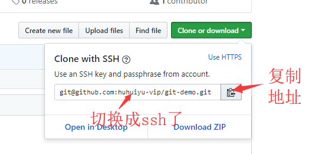  
  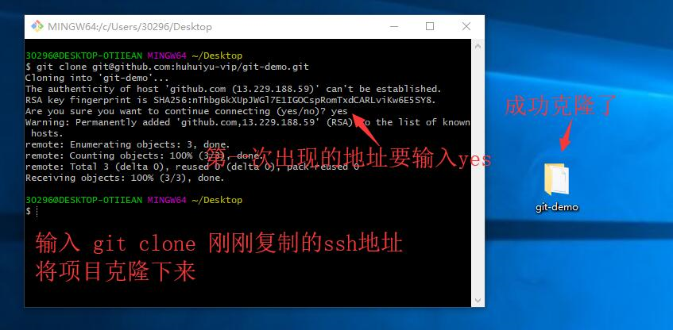  
  ***
- [返回](README.md)