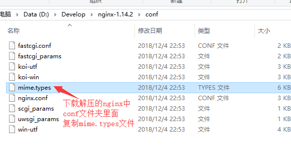

# nginx安装和基础配置

- [返回](README.md)
  ***
- [nginx官方网站](http://nginx.org/)  
    
    
    
    
    
    
    
    
    
    
    
    
    
    
    
- `nginx.conf`的内容

```nginx
events {
#连接数配置
    worker_connections 1024;
}
#http服务配置
http {
#包含类型配置文件
    include mime.types;
#服务器配置
    server {
#下面的配置表示当访问http://本机ip地址的时候会展示html目录下面的index.html
#如果监听端口号不是80，需要通过http://本机ip地址:端口号访问
#监听端口号，80是http默认端口
        listen 80;
#服务器名称，0.0.0.0表示本机所有ip地址，也可以是域名
        server_name 0.0.0.0;
#默认编码
        charset utf-8;
#虚拟目录配置,/表示服务器根
        location / {
#root表示虚拟目录对应的文件目录
            root html/;
#index是默认文档
            index index.html;
        }
    }
}
```

- `start.bat`的内容`D:\Develop\nginx-1.14.2\nginx -c nginx.conf`
- `stop.bat`的内容`D:\Develop\nginx-1.14.2\nginx -s stop -c nginx.conf`
  ***
- [返回](README.md)