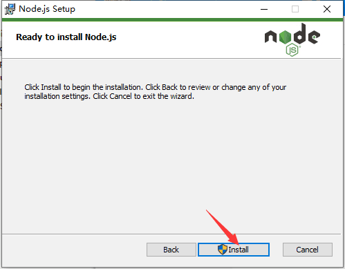

# nodejs安装

- [返回](README.md)
  ***
- [nodejs官方网站](https://nodejs.org/)  
    
    
    
    
    
    
    
    
    
    
    
    
    
    
  上面的几个指令

  ```cmd
  node -v
  npm -v
  npm install -g cnpm --registry=https://registry.npm.taobao.org
  cnpm -v
  ```

  ***
- [返回](README.md)