# vscode基础配置

- [返回](README.md)
  ***
- vscode基础配置  
  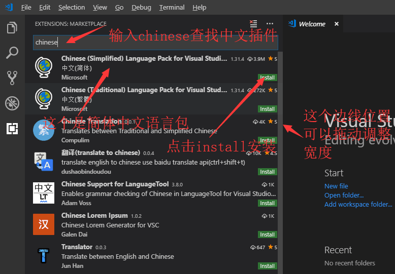  
  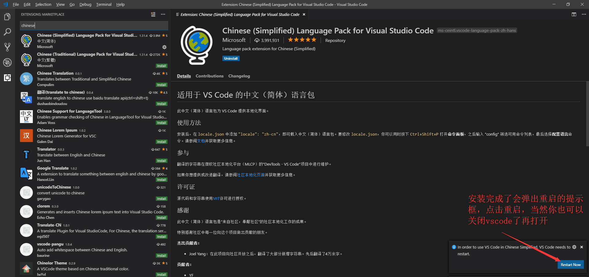  
  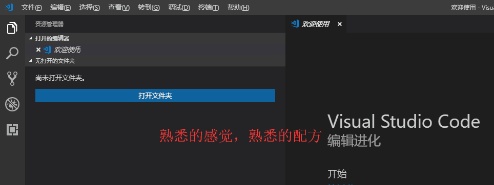  
  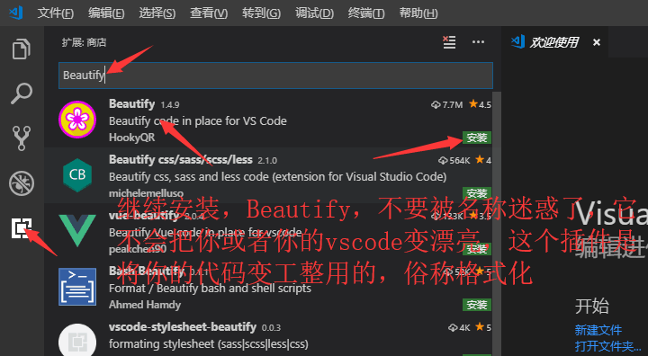  
  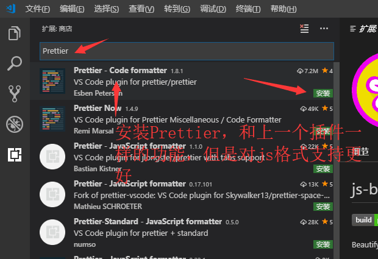  
    
  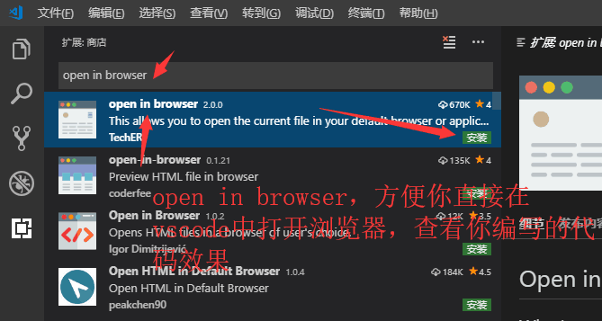  
  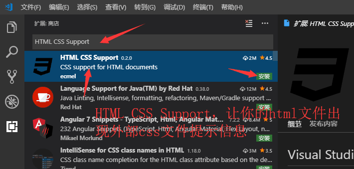  
  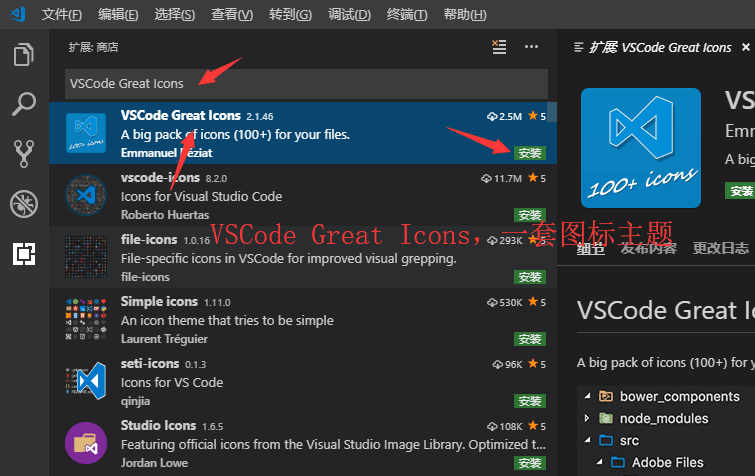  
  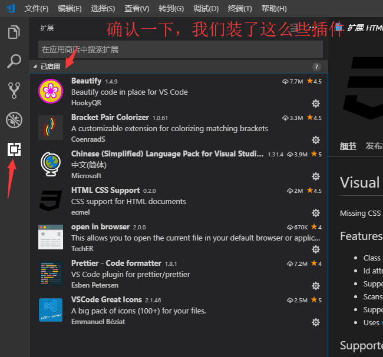  
  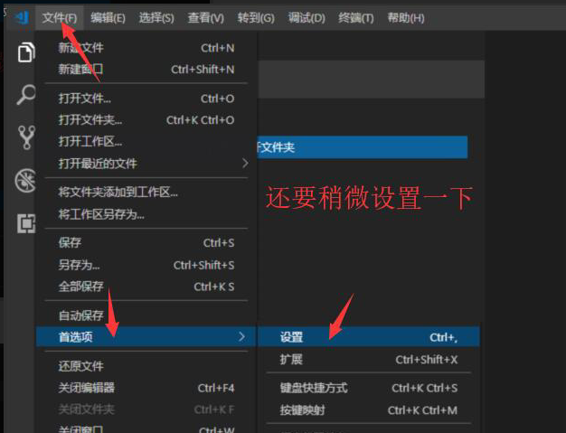  
  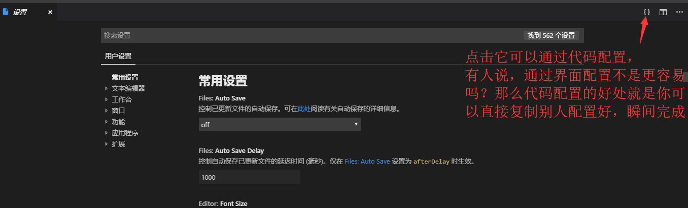  
  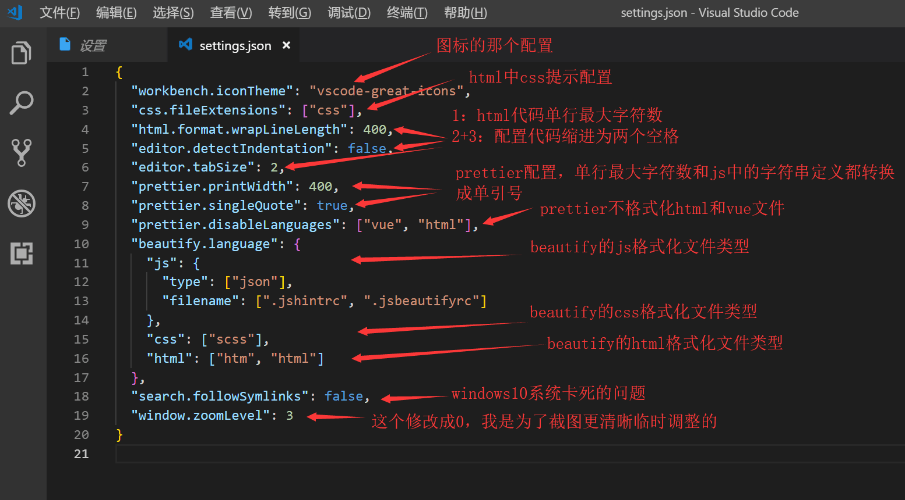  
  ***
- 配置代码

```json
  {  
    "workbench.iconTheme": "vscode-great-icons",
    "css.fileExtensions": ["css"],
    "html.format.wrapLineLength": 400,
    "editor.detectIndentation": false,
    "editor.tabSize": 2,
    "prettier.printWidth": 400,
    "prettier.singleQuote": true,
    "prettier.disableLanguages": ["vue", "html"],
    "beautify.language": {
      "js": {
        "type": ["json"],
        "filename": [".jshintrc", ".jsbeautifyrc"]
      },
      "css": ["scss"],
      "html": ["htm", "html"]
    },
    "search.followSymlinks": false,
    "window.zoomLevel": 0
  }
```

  ***

- [返回](README.md)